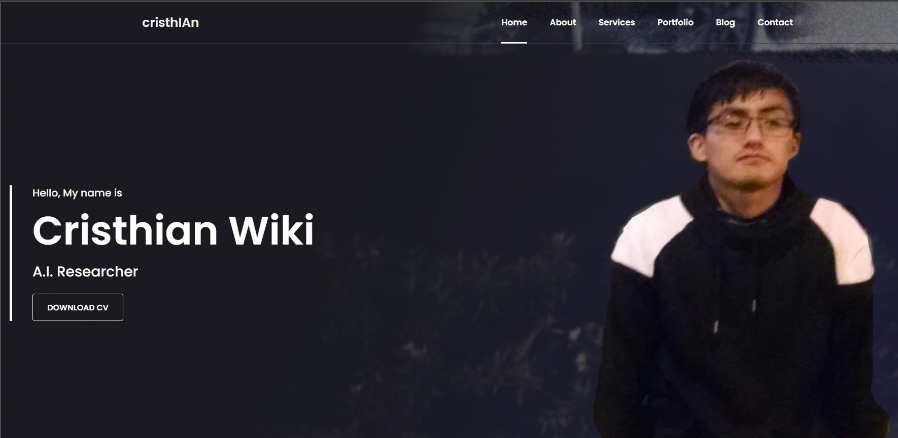

<h2 align="center">
<p>Mi portafolio v1 ❤️</p>
</h2>

<p align="center"> 

</p>

Hecho 100% con js vanilla y css. Para lanzarlo, ejecute los siguientes comandos:
```bash
pip install -r requirements.txt
python index.py
```
y abra su locahost en el puerto 5000.